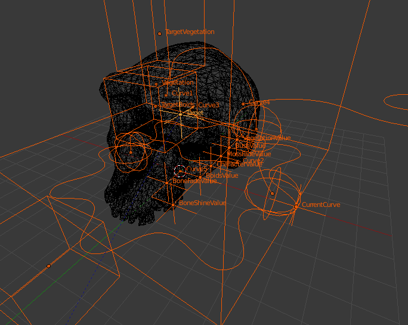
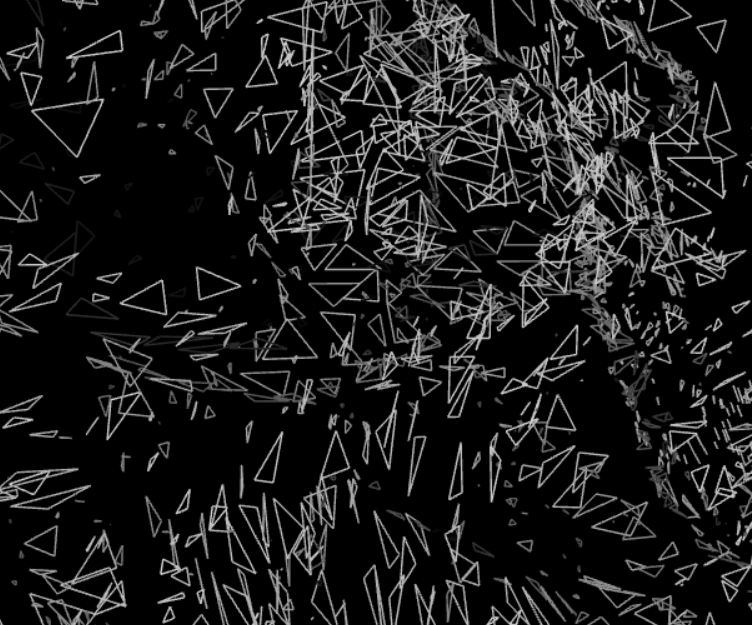
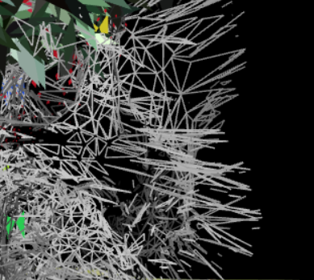
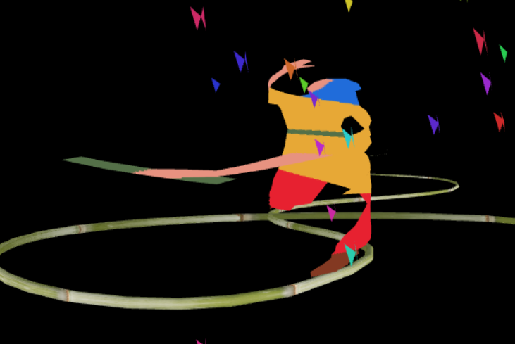
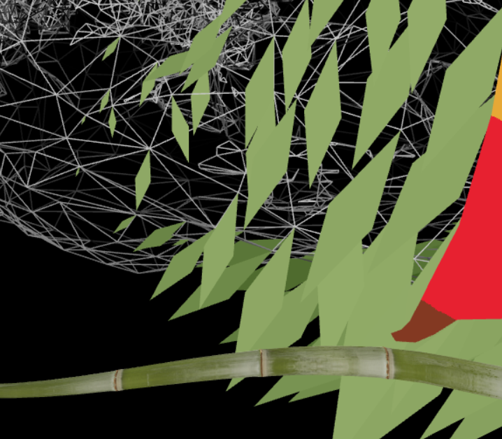
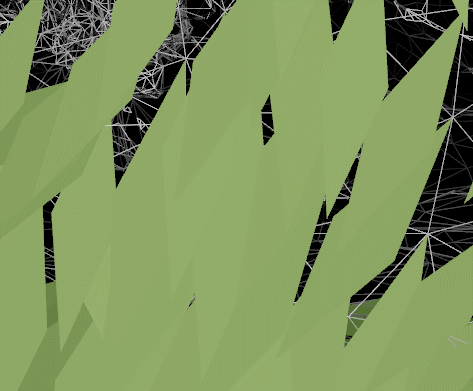
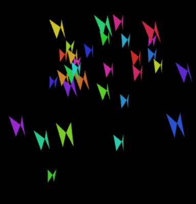

# Naturally Undead

First PC Demo made with love for [Evoke 2016](https://www.evoke.eu/2016/).  
Shader experiments with point clouds, boids, curves and particles.  
WebGL engine made with [TWGL](https://twgljs.org/).  
Visual by Leon Denise (ponk)  
Music by Eric Wager (dok)  

**Warning : the source code is a complete mess.**  
But I can tell you what files are involved in the effects.

## About Blender

You will find a Blender file (blender/Scene.blend) that was used to make the demo.  
I'm using this [awesome addon](https://github.com/KoltesDigital/blender-html5-animations) made by Jonathan Giroux (Koltes), to export animations to WebGL.  

## Triangles effects
    

There is a script that parse the mesh to assign attributes to vertices ([parseMesh.js](scripts/helpers/geometries/parseMesh.js))  
And there is a vertex shader that animate triangles ([bone.vert](assets/shaders/mesh/bone.vert))

## Curve modifier
  

I'm loading curves to floating point texture and then the vertex shader is doing his job ([bamboo.vert](assets/shaders/mesh/bamboo.vert)).  
More details about the effect [here](http://github.com/leon196/CurveModifier).

## Moss effect
  

The geometry generation is made with [moss.js](scripts/entities/elements/moss.js)  
The shader is calculating distance from a target to set leaves size ([moss.vert](assets/shaders/particles/moss.vert)).  

## Boids
  

The good old boids : [bois.js](scripts/entities/base/boid.js),  [butterflies.js](scripts/entities/elements/butterflies.js) and [butterfly.vert](assets/shaders/particles/butterfly.vert).  

## Leaves effect

This is a point cloud of plants from my mother's garden.  
There is a 3d file storing positions, colors and normals ([vegetation.ply](assets/clouds/vegetation.ply)).  
The script [parsePointCloud.js](scripts/helpers/geometries/parsePointCloud.js) create geometry from the points and assign attributes to the vertices that going to be used in the vertex shader.  
Then there is a vertex shader that make the falling animation ([leaf.vert](assets/shaders/particles/leaf.vert)).

## Text

You can check the messy [text.js](scripts/helpers/graphics/text.js) and [painting.js](scripts/entities/elements/painting.js) + [painting.vert](assets/shaders/particles/painting.vert).

  
